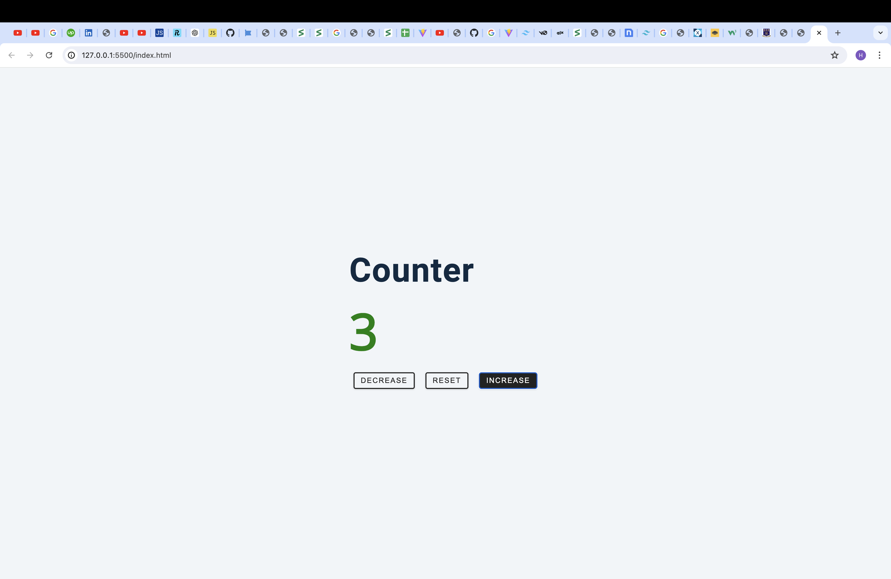

# description of app
-this is a counter app that can be increased,decreased and changed back to reset.
-when we click on the decrease button the number is deducted by one and when the numbers are in negative the colors changes  to red.
-when you click on the increase button one is added to the number and if the numnbers are positive the color is green
-when you click on the reset button the number goes back to 0 and  then th color changes to black

# screenshot

